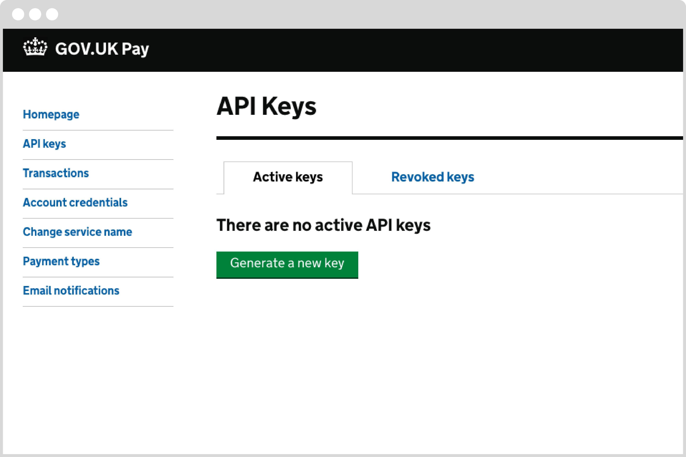
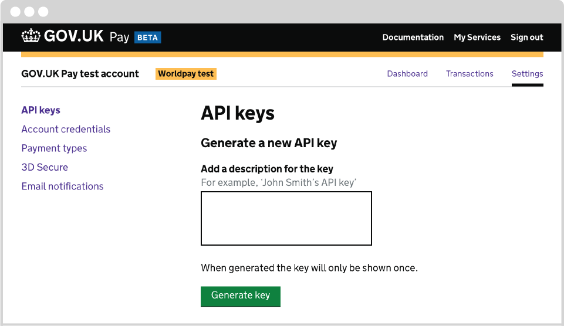
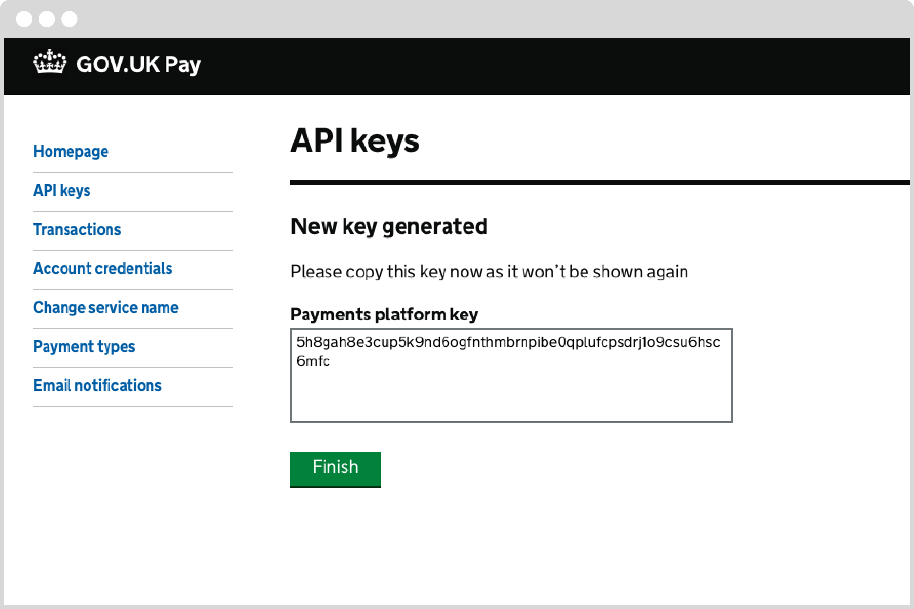
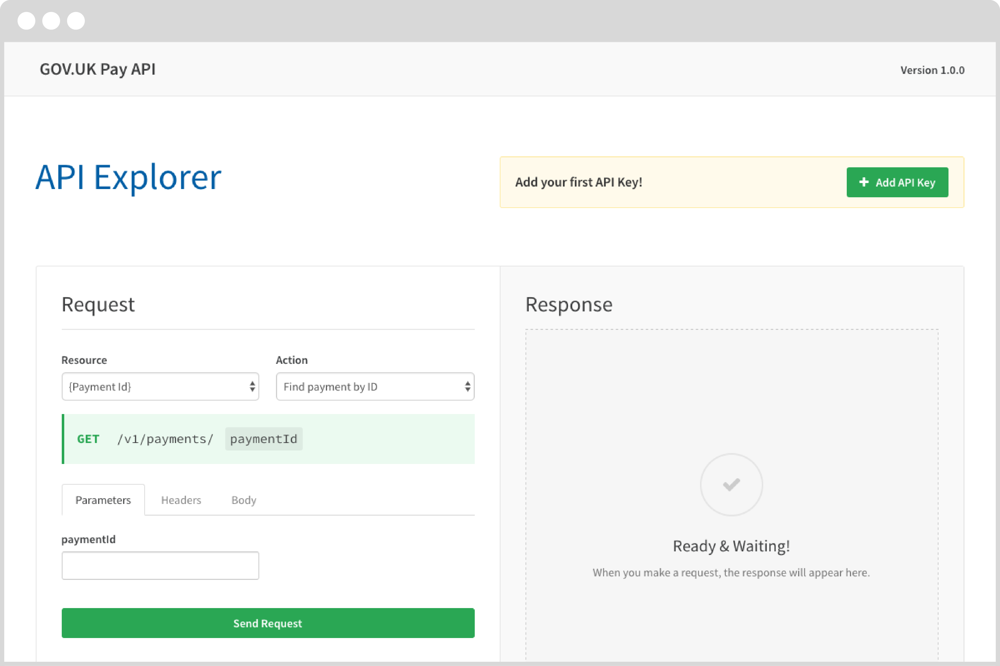

# Quick start guide

The GOV.UK Pay platform is based on REST principles with endpoints returning data in JSON format, and standard HTTP error response codes. The platform API allows you to:

- initiate and complete payments
- issue refunds
- view the event history for individual payments
- view transactions within a specified time period
<br /><br />
This section explains how to get started with our API Explorer and make a test API call.

## Generate API Key for API Explorer

1. Sign in to the [GOV.UK Pay admin site](https://selfservice.payments.service.gov.uk/) with the sandbox account login details you received.

1. Click on the API key section, then click **Generate a new key**.


 <br /><br />Enter a description for your API key. <br /><br />
 
 

<br /><br />Your API key will be shown on the screen for you to copy.<br /><br /> 


<blockquote>You must store your API keys away securely. Make sure you never share this key in publicly accessible documents or repositories, or with people who should not be using the GOV.UK Pay API directly. <a href="https://docs.payments.service.gov.uk/#security">Read our security section</a> for more information on how to keep your API key safe.</blockquote>

## API Explorer setup

The quickest way to learn about the API is to use the <a href="https://gds-payments.gelato.io/api-explorer/" target="blank">API Explorer</a> (link opens in new window) with the API key that you just created.

1. Go to the <a href="https://gds-payments.gelato.io/api-explorer/" target="blank">API Explorer</a> (link opens in new window), sign in, and click the “Add API Key” button.<br/><br/>

<br/><br/>
1.  In the resulting pop-up, enter the following values:
  + For **API Key**, enter "[YOUR-API-KEY]" (do not include the quotation marks), replacing [YOUR-API-KEY] with the actual value of your sandbox API key. You do not need to put the "Bearer: " prefix which is required when calling the API from code; the API Explorer adds that automatically.
  + For **Label**, enter "Authorization" (do not include the quotation marks).

> Make sure you are using an API key from your sandbox account on the admin site, not the live account.

## Making a test API call

You will now make a test API call to GOV.UK Pay by creating a new payment. This is the call your service will make when 
initiating a payment using GOV.UK Pay.

1. To test the API Explorer, select General from the API Explorer **Resource** dropdown menu. Select <a href="https://gds-payments.gelato.io/api-explorer/gov-uk-pay-api/versions/1.0.1/general/create-new-payment" target="blank">Create new payment</a> (link opens in new window) from the API Explorer **Action** dropdown menu. Click on the **Body** tab lower down to see an example JSON body that you would send when creating a payment.

```javascript
{
"amount": 12000,
"reference": "12345",
"description": "New passport application",
"return_url": "https://service-name.gov.uk/transactions/12345"
}
```

As well as details of the payment, you'll notice that you need to send a ``return_url`` when creating a payment. The reason for this is that users go to GOV.UK Pay hosted pages to actually make their payment.
The ``return_url`` is the URL of a page on your service that the user will be redirected to after they have completed their payment (or payment has failed).
<br/><br/>


1. Click the green **Send Request** button.

1. If the API Explorer is set up correctly, you will receive a 201 Created response with a JSON body, confirming that the payment was created. Note that the JSON includes a ``next_url`` link. This URL is where your service should redirect the user for them to make their payment.
<br/><br/>


## Follow end user payment journey

1. Go to the ``next_url`` with your browser. You'll see the payment screen. Refer to the [Testing GOV.UK Pay](https://docs.payments.service.gov.uk/#testing-gov-uk-pay) section to find a mock credit card number that you can enter to simulate a payment in the sandbox environment. For the rest of the details, enter some test information, bearing in mind that:
    + the expiry date must be in the future and in the format MM/YYYY
    + the postcode must be valid

1. Submit the payment.

## View transaction at GOV.UK Pay Admin site

1. Go to the [service admin site](https://selfservice.payments.service.gov.uk/). Select **Transactions** at left. You’ll see the payment you just made.


## Self-service payments

You may want to use self-service payment links rather than integrate with the GOV.UK Pay API if your service:

- is non-digital and uses paper applications to process payments
- is non-digital and has low transaction volumes
- asks users for payment by sending email or letters
- does not have a development team that can integrate your service with GOV.UK Pay

### Prerequisites

Before you set up a self-service payment link, you must have a [live service](/#switching-to-live). You do not need an [API key](/#generate-api-key-for-api-explorer) or to use the [API explorer](/#api-explorer-setup).

### Create a payment link

1. Sign in to your [GOV.UK Pay account](https://selfservice.payments.service.gov.uk/).
1. Select [Create a payment link](https://selfservice.payments.service.gov.uk/create-payment-link) in the Dashboard.
1. Select __Create a payment link__.

### Set payment link information

On the __Set payment link information__ page:

1. Complete the __Title__ field.  
1. Complete the optional __Details__ field if necessary, and select __Continue__.
1. You must change your payment link if it is identical to an existing link.

### Specify payment reference

1. Select either __Yes, create a unique payment reference number for my users__ or __No, I would like to use my own__.
1. If you selected __No, I would like to use my own__, complete the __Name of your payment reference number__ and optional __Hint text__ fields if necessary.
1. Select __Continue__.

### Specify whether payment is fixed or variable

1. Select __Yes__ or __No, the user can choose the amount for the payment amount__
1. If you selected __Yes__, enter the payment amount.
1. Select __Continue__.

### Review payment link details

1. Review your payment link details.
1. Select __Create link__.

You can now send the live payment link to your users.

### Reference number and confirmation

Your users will receive a reference number and confirmation email when they use a self-service payment link. You can find the reference number on the [Transactions page](https://selfservice.payments.service.gov.uk/transactions). You will not receive a transaction reference number by default, unless you tell your users to send them to you.

GOV.UK Pay creates and hosts the self-service payment confirmation page.
