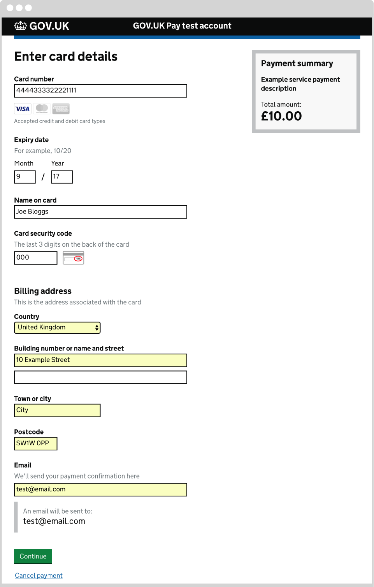
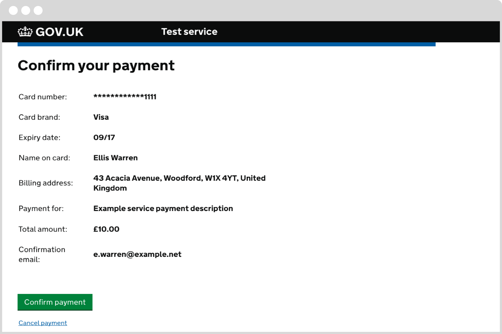

# Payment flow overview

This section outlines how your service will interact with GOV.UK Pay after integration.

>This does not apply to users who use the [self service payments](/#self-service-payments) functionality.

## Overview of payment flow

When an end user needs to make a payment, your service makes an API call to create a new payment, then redirects the user to the payment pages hosted on GOV.UK Pay.

The end user enters their payment details (for example, credit/debit card details and billing address) on the Pay pages. Pay handles all the details of verifying the payment with the underlying Payment Service Provider.

After the transaction reaches a final state, the end user is then redirected back to your service.

A final state means that the payment:

+ succeeds
+ fails either because it is declined or the user chooses to cancel
+ fails due to a technical error
+ fails because it is cancelled by your service

When the user arrives back at your service, you can use the API to check the status of the transaction and show them an appropriate message.


## Payment flow: making a payment

Let's walk through an example of the payment flow in more detail.

Imagine that this is a page on your service, where the end user needs to make a payment.


>The payment pages are responsive and work on both desktop and mobile.

Note that this page might be the end point of a series of pages you host which allow the user to choose between a variety of possible payments. This page should:

- make it clear to the user that they are about to pay for your product or service with a clear call to action, for example, a button that says “Pay now” or “Continue to payment”; the user will then be taken to the GOV.UK Pay pages to complete their transaction 
- include clear information on what is being purchased; you do not need to tell the user that they are being handed over to GOV.UK Pay’s pages to make their payment

The user clicks **Continue**.

At this point, your service makes a <a href="https://gds-payments.gelato.io/api-explorer/gov-uk-pay-api/versions/1.0.2/general/create-new-payment" target="blank">Create new payment</a> call to the Pay API (link opens in new window). The body of the call contains information in JSON format:


```javascript
{
  "amount": 14500,
  "reference" : "12345",
  "description": "Payment description",
  "return_url": "https://your.service.gov.uk/completed"
}
```


+ **amount**: in pence; in this example, the payment is for £145
+ **reference**: This is the reference number you wish to associate with this payment. The format is up to you, so if you have an existing format, you can keep using it with Pay (maximum 255 characters; it must not contain URLs)
+ **description**: A human-readable description of the payment; this will be shown to the end user on the payment pages and to your staff on the GOV.UK Pay admin site (maximum 255 characters; it must not contain URLs)
+ **return_url**: This is an HTTPS URL on your site that the user will be sent back to once they have completed their payment attempt on GOV.UK Pay (this should not be JSON-encoded as backslashes will not be accepted)

This is the header and the first part of the JSON body of the response to the **Create new payment** API call that your service will receive:

```response
HTTP/1.1 201 Created
Content-Type: application/json
Location: https://publicapi.pymnt.uk/v1/payments/icus7b4umg4b4g5fat4831es5f
```

```javascript
{
  "payment_id": "icus7b4umg4b4g5fat4831es5f",
  "payment_provider": "acme",
  "amount": 14500,
  "state": {
    "status": "created",
    "finished": false
  },
  "description": "Payment description",
  "return_url": "https://your.service.gov.uk/completed",
  "reference": "12345",
  "created_date": "2016-06-24T11:46:11.414Z",
  "_links": {
    "self": {
      "href": "https://publicapi.pymnt.uk/v1/payments/icus7b4umg4b4g5fat4831es5f",
      "method": "GET"
    },
    "next_url": {
      "href": "https://www-integration-2.pymnt.uk/secure/bb0a272c-8eaf-468d-b3xf-ae5e000d2231",
      "method": "GET"
    },
 ...}  
}
```

The beginning of the response confirms the properties of the attempted payment.

The ``self`` URL (also provided in the Location header of the response) is a unique identifier for the payment. It can be used to retrieve its status details in future.

The ``next_url`` is the URL where you should now direct the end user. It points to a payment page hosted by GOV.UK Pay where the user can enter their payment details. Note that this is a one-time URL; after it's been visited once, it will give an error message.

When your service redirects the user to ``next_url``, they see a page something like this:



The page shows the ``description`` you provided as well as the amount the end user has to pay, making it clear what they're paying for.

The user enters their payment details and clicks **Continue**.

GOV.UK Pay will then attempt a payment authorisation through the Payment Service Provider (PSP). This checks with the card issuer whether there are sufficient funds available to make this payment and also carries out some anti-fraud checks.

## Payment Flow: Payment successful

If the details are valid and the payment is approved by the PSP, the user is then taken to a payment confirmation page, still hosted by GOV.UK Pay, where the user decides whether or not to complete their payment:



If the user decides to complete the payment, they click confirm, and will:

- receive a confirmation email (if you have chosen to send these using GOV.UK Pay)
- be re-directed to your `return_url` page which will then send the user to your payment confirmation page

### Confirmation email

The user will receive a payment confirmation email containing:

- a payment reference number
- the date of payment
- who the payment was to
- the total payment amount

You can add a custom paragraph to a payment confirmation email at the [Email notifications page](https://selfservice.payments.service.gov.uk/email-notifications) on the GOV.UK Pay admin site. For further customisation, you can visit [GOV.UK Notify](https://www.notifications.service.gov.uk/) to set up custom notifications. It is recommended to disable GOV.UK Pay notifications if you do this.

### Confirmation page

The confirmation page is hosted by you and should:

- confirm that the payment has been received successfully
- contain a reference number (make them short and usable)
- have a clear payment summary, showing the amount and description
- clearly state what is going to happen next (this will be different for each service)
- if applicable, let the user know they will receive a receipt email (services can either use GOV.UK Notify to send email payment receipts or ask GOV.UK Pay to do that for them)

Users have different ways of recording this confirmation information, including screenshots, prints, pdf receipts to download, and writing down the reference number and other relevant information. Teams building services should be aware of, and cater for, all these behaviours.

>Read more about confirmation pages in the [service manual](https://www.gov.uk/service-manual/design/confirmation-pages).

## Payment Flow: Payment fails

The payment can fail at any point in the process due to:

+ the payment being declined or the user choosing to cancel
+ a technical error
+ the payment being cancelled by your service

If the payment fails, the user will see a GOV.UK Pay error page. This includes a link to return to your service that states _Go back to try the payment again_. When a user returns to your service after a failed payment you should show them a page that offers useful next steps. This page should:

- confirm that the payment failed
- offer the user a chance to try the payment again either by initiating a new payment with GOV.UK Pay or using another method supported by your service
- advise the user of an alternative course of action

An example can be seen below:


## Payment flow: Check the status of a payment

Regardless of the payment outcome, when a payment journey has reached a terminal state, GOV.UK Pay will return the user to the `return_url` you provided in the initial request. 

The `return_url` should specify a page on your service. When the user visits the `return_url`, your service should:

- match the returning user with their payment (with a secure cookie, or a secure random ID string included in the `return_url`)
- check the status of the payment using an API call
- display an appropriate final page as outlined above (hosted by your service)

See the [Integration details](https://docs.payments.service.gov.uk/#integration-details) section for more details about how to match the user to the payment.

To check the status of the payment, you must make a <a href="https://gds-payments.gelato.io/api-explorer/gov-uk-pay-api/versions/1.0.2/v1/find-payment-by-id" target="blank">Find payment by ID</a> API call (link opens in new window), using the ``payment_id`` of the payment as the parameter.

The URL to do this is the same as the ``self`` URL provided in the response when the payment was first created.

The response body contains information about the payment encoded in JSON format. Here is the beginning of a typical response:

```javascript
{
  "payment_id": "i3us7bqumg4b4g5fae48h1es5f",
  "payment_provider": "acme",
  "amount": 14500,
  "state": {
    "status": "success",
    "finished": true
  },
...
}
```

The ``state`` array within the JSON lets you know the outcome of the payment:

+ The ``status`` value describes a stage of the payment journey.
+ The ``finished`` value indicates if the payment journey is complete or not; that is, if the ``status`` of this payment can change.

Now that you understand the payment process, see the [Integration details](https://docs.payments.service.gov.uk/#integration-details) section for more  about how you can integrate your service with GOV.UK Pay.

## Payment flow: Resume a payment

If your user starts a payment but does not complete it, they can resume that incomplete payment. An example of this could be if they click the browser's back button during a payment, and then go forward by clicking the links on your website. 

If your service uses the resume payment feature:

- you will minimise the number of expired payments
- you will not unnecessarily create new payments

## Payment flow: Payment expires

Payments that are not confirmed and completed after 90 minutes will expire automatically. 

If the payment was authorised but incomplete, GOV.UK PAY will send a cancellation to the payment provider. This will raise a [P0020 API error](/#api-errors-caused-by-payment-statuses).

### Incomplete payments

An incomplete payment will have a status of `created`, `started` or `submitted`. These payment types have a `next_URL`. The `next_URL` is where you should direct the user next in the payment process. You will receive a `next_URL` every time you query the status of a payment using the API.

### Resuming a payment

When a user resumes a payment, the `next_URL` will take them to a screen that is appropriate for their payment's current status. For example, a payment with a `started` status will resume at the card details input page. The `next_URL` is a one-time URL; if a payment has already resumed using a `next_URL`, that URL will not be usable again.

A payment cannot resume if it has a status of `success`, `failed`, `cancelled` or `error`. If your service tries to resume a payment of this type, the user will be sent to your service's `return_url`. The `return_url` is the URL of a page on your service that we send the user to after they have completed their payment attempt.   
