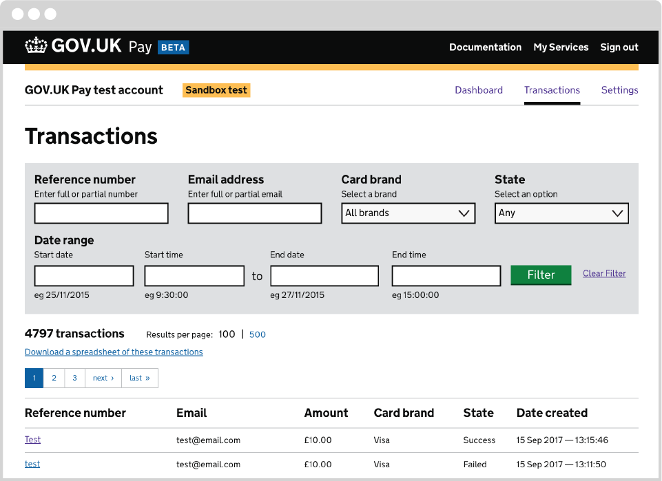
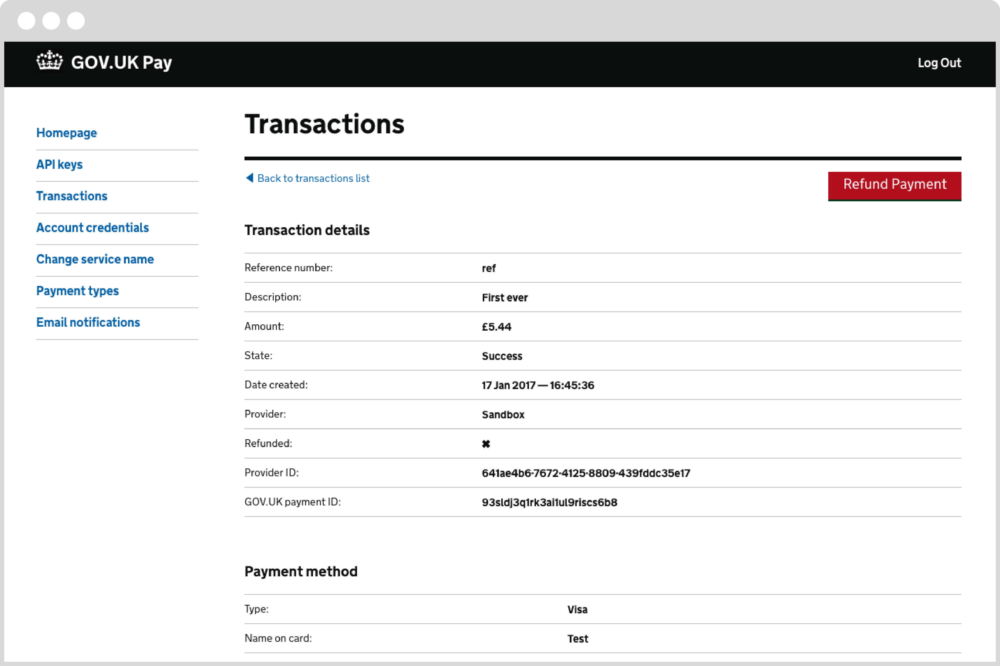

# Refunding payments

GOV.UK Pay now supports refunding payments. You can choose to refund part of a payment, or the full amount.

After issuing a partial refund of a payment, you can issue further partial refunds, until the full amount of the original payment has been refunded.

Each payment has a refund status which can take one of the following values:

| Payment refund status | Meaning                                                                                                                                                                            |
|-----------------------|------------------------------------------------------------------------------------------------------------------------------------------------------------------------------------|
| pending               | The payment is potentially refundable, but is not ready to be refunded yet.                                                                                                        |
| unavailable           | It is not possible to refund the payment: for example, the payment failed.                                                                                                         |
| available             | It's possible to initiate a refund. Note that this does not mean that the full original value of the payment is available to refund: there may have been previous partial refunds. |
| full                  | The original value of the payment has been fully refunded, so it is not possible to refund any more.                                                                               |

In the sandbox, you will not see the ``pending`` status as there is no delay in processing a payment. In a live environment, successful payments will spend some time in ``pending`` state before a refund becomes possible.

> This refund status is a property of a payment; each refund will also have its own status of submitted/success/error.

## Payment refund status and partial refunds

You can find out the refund status of a payment with the API using the <a href="https://gds-payments.gelato.io/api-explorer/gov-uk-pay-api/versions/1.0.1/v1/find-payment-by-id" target="blank">Find payment by ID</a> or <a href="https://gds-payments.gelato.io/docs/versions/1.0.1/resources/general/endpoints/search-payments" target="blank">Search payments</a> functions (links open in new window).

The response will contain a ``refund_summary`` section. Here is an example of that section of the response for a completed £50 payment with no previous refunds:

```javascript
  "refund_summary": {
    "status": "available",
    "amount_available": 5000,
    "amount_submitted": 0
  },
```

In this example, the refund status of the payment is ``available``, indicating that a refund can be initiated. The ``amount_available`` value is 5000: that is, £50 is available to be refunded.

The ``amount_submitted`` is 0, showing that there have been no previous refunds.

Partial refunds are possible, and you can make multiple partial refunds against the same payment. As you'd expect, the total of refunds against a payment cannot be greater than the original payment.

Here's another example:

```javascript
  "refund_summary": {
    "status": "available",
    "amount_available": 6000,
    "amount_submitted": 3000
  },
```

In this case, the original payment was for £90. The ``amount_available`` value shows that only £60 is available to be refunded, because £30 has already been refunded in one or more partial refunds (as shown by ``amount_submitted``).

If you needed to know the details of the partial refunds (for example, whether there had been a single refund of £30 or multiple smaller refunds), you could use the API function to <a href="https://gds-payments.gelato.io/docs/versions/1.0.1/resources/payment-id/endpoints/get-all-refunds-for-a-payment" target="blank">Get all refunds for a payment</a> (link opens in new window).

## Specifying the expected refund available

When you submit a refund request for a payment via the API, you can optionally specify a ``refund_amount_available`` value in the body of the request.

This is so you can provide the total amount of the original payment you expect to be available for refund at the time your refund request is made.

The purpose of this is to prevent accidentally processing a partial refund more than once, by rejecting requests where your ``refund_amount_available`` does not match the real amount that's available to be refunded.

For example, suppose a payment was made for £5, but later it turns out the user is due a £2 refund. Your system for processing refunds submits a request for a £2 refund to our API, but it accidentally gets sent twice. Without a ``refund_amount_available`` specified, GOV.UK PAY would have no way to tell the second request was a mistake, so it would process both requests, generating two refunds of £2 each.

Now imagine the same scenario, but if you had specified the ``refund_amount_available`` as £5. The first request still succeeds, leaving £3 available to be refunded. When the accidental duplicate request comes in, it has a ``refund_amount_available`` of £5, even though only £3 is available, so GOV.UK PAY can tell that it's a stale request, and it is rejected.

We recommend that your service tracks the expected refund amount available and submits a ``refund_amount_available`` value whenever you request a refund via the API.

When a refund request is rejected due to a refund amount available mismatch, the error code returned is P0604, with an HTTP status of 412.

## Refunding with the API

You can initiate a refund with the <a href="https://gds-payments.gelato.io/api-explorer/gov-uk-pay-api/versions/1.0.1/payment-id/submit-a-refund-for-a-payment" target="blank">Submit a refund for a payment</a> function (link opens in new window).

You need to specify the ``paymentId`` of the original payment, and provide the amount to refund (in pence).

You should check that the amount you attempt to refund does not exceed the ``amount_available`` value; otherwise you will receive a P0603 error like this:

```
{
"code": "P0603",
"description": "The payment is not available for refund. Payment refund status: amount_not_available"
}
```

Each refund has a unique ``refund_id``.

You can use the <a href="https://gds-payments.gelato.io/docs/versions/1.0.1/resources/payment-id/endpoints/get-all-refunds-for-a-payment" target="blank">Get all refunds for a payment</a> function (link opens in new window) to get information all the refunds for a payment (including their ``refund_id``s).

You can retrieve information about an individual refund using the <a href="https://gds-payments.gelato.io/api-explorer/gov-uk-pay-api/versions/1.0.1/payment-id/find-payment-refund-by-id" target="blank">Find payment refund by ID</a> function (link opens in new window).


## Handling refund errors

When you try to create a refund with the API, it may fail immediately - for example if you try to refund more than the amount available. In that case, the original <a href="https://gds-payments.gelato.io/api-explorer/gov-uk-pay-api/versions/1.0.1/payment-id/submit-a-refund-for-a-payment" target="blank">Submit a refund for a payment</a> request (link opens in new window) will return an error code and a description of what it means. (A refund attempt that fails like this with an error code is not assigned a refundId and is not available using <a href="https://gds-payments.gelato.io/api-explorer/gov-uk-pay-api/versions/1.0.1/payment-id/find-payment-refund-by-id" target="blank">Find payment refund by ID</a> (link opens in new window)).

If accepted by GOV.UK Pay, a refund may still go on to fail at the PSP. This may happen if the card involved is cancelled or has expired, or if your account with the PSP does not have enough funds to cover the refund.

Each refund has a processing status indicated by a "status" value that is returned in response to a successful request to a ``/refunds/`` endpoint.

This is a partial example of a response including the refund's processing status:

```javascript
{
"amount": 1500,
"created_date": "2016-10-17T16:53:03.213Z",
"refund_id": "j6se0f2o427g28g8yg3u3i",
"status": "submitted",
...
```

Initially, in a live environment, the status returned will be ``submitted``. After the PSP has processed the refund, the status returned will be ``success`` or ``error``. (In the sandbox environment, the status will always go straight to ``success``).

| Refund processing status | Meaning                                                                                                            |
|--------------------------|--------------------------------------------------------------------------------------------------------------------|
| submitted                | The refund request is valid as far as GOV.UK Pay can tell and has been passed to the underlying payment processor. |
| success                  | The refund has been successfully processed.                                                                        |
| error                    | It was not possible for the payment processor to make the refund.                                                  |


To handle this, you must use <a href="https://gds-payments.gelato.io/api-explorer/gov-uk-pay-api/versions/1.0.1/payment-id/find-payment-refund-by-id" target="blank">Find payment refund by ID</a> (link opens in new window) to check the processing status of the refund until it changes to either ``success`` or ``error``.

It will typically take 30 minutes for the status to change. We suggest you check the status after 30 minutes, and do not repeat more than once every 5 minutes.

In the event of an error, GOV.UK Pay will not currently provide any more information. Please contact us if more information is required about why a refund failed.


## Refunds from the admin site

As an alternative to refunding via the API, you can use the service admin site at https://selfservice.payments.service.gov.uk  to view transactions and issue refunds.

Go to the Transactions section of the site to see a list of transactions.



In this list, click on the reference for an individual payment (in the **Reference number** column) to see details of that payment (including any previous refunds).

In the details view, you can use the red **Refund payment** button at the upper right to carry out a full or partial payment.




## Refund notifications

End users are automatically notified by email about successful payments (according to the settings you have entered in the self-service admin site), but not when a payment has either failed or is refunded (either manually or via the API). You should arrange to notify end users about payment failures and / or refunds as appropriate for your service.

## Refund Destination

Refunds are sent back to the source account of the original payment. It is not possible to refund a payment to another card or bank account. If the original card expired or was canceled, the bank will attempt to credit the customer’s new card with the refund. If this attempt fails, or the customer does not have a new card, the refund will have to be made using another channel (eg bank transfer or cheque).
