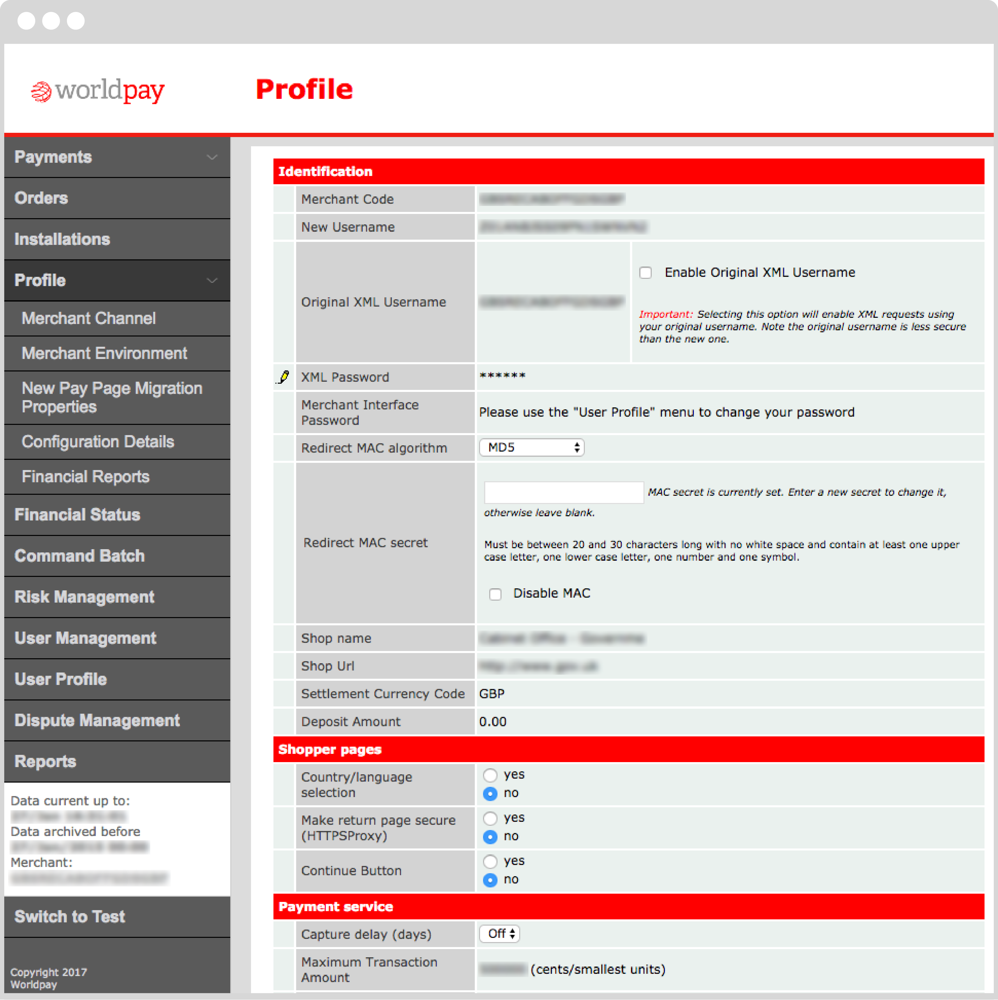
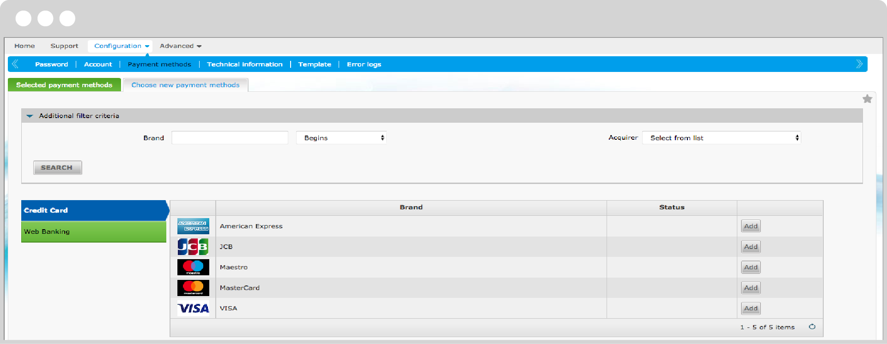
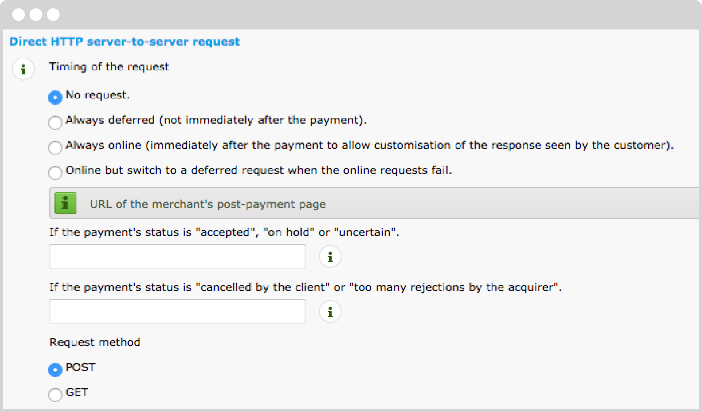
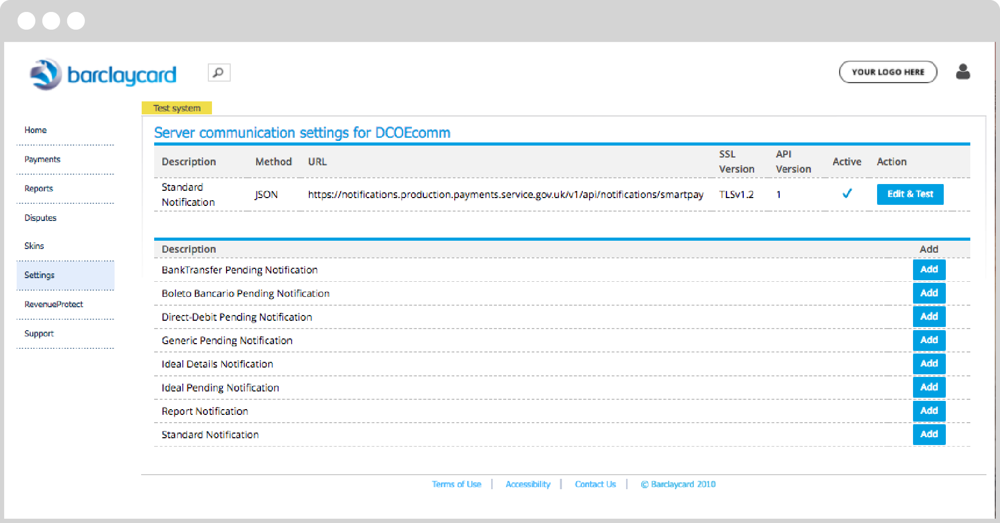

# Switching to live

Once you have finished testing with your sandbox account, here are the steps you will need to take to switch over from testing to live.

Unless stated otherwise, this section applies both to services that have integrated with the GOV.UK Pay API, and to services that use the [self service payment link](/#self-service-payments) functionality.

## Set up GOV.UK Pay account

### Request a live account

Request a live account by emailing GOV.UK Pay at [govuk-pay-support@digital.cabinet-office.gov.uk](a href="mailto:govuk-pay-support@digital.cabinet-office.gov.uk"). Once you have a live account, it will appear in the “My Services” section and be clearly labelled as a “Live” account.

### Complete organisation details

Payment card schemes require the details of the organisation taking payment to be shown on payment pages where the user enters card details. This information is displayed in the payment page footer. Note that:

- the organisation must be the entity that has a contract with the PSP
- organisation details are not specific to test or live accounts, meaning that if you complete the details for your test account then they will be transferred to your live account automatically

To complete your organisation details:

1. Go to the [GOV.UK Pay admin site](https://selfservice.payments.service.gov.uk/login).
1. Sign in to your GOV.UK Pay account.
1. Go to _Switch services > Edit organisation details_.
1. Complete the _Organisation name_ and _Organisation address_ fields on this page.
1. Click _Save_ to see the following message: "Organisation details updated".

### Set up live account credentials

To set up your live account credentials:

1. Go to the [GOV.UK Pay admin site](https://selfservice.payments.service.gov.uk/login).
1. Sign in to your GOV.UK Pay account.
1. Go to _My Services_ and click on the live service you want to set up.
1. Go to _Settings > Account Credentials > Edit credentials_.
1. Complete the fields on this page; these will vary depending on which live service you use.

#### ePDQ

Complete the fields on the Account credentials page:

- _PSP ID_ - enter your PSP ID for ePDQ
- _Username_ - enter the API user’s username
- _Password_ - enter the API user’s password
- _SHA-IN passphrase_ - this passphrase is created on the [_Data and origin verification_ page](/#set-up-checks-for-e-commerce-amp-alias-gateway)
- _SHA-OUT passphrase_ - this passphrase is created on the [_All transaction submission modes_ page](/#set-up-security-for-request-parameters)
- click _Save credentials_ to go back to the _Account Credentials_ page

#### Worldpay

Complete the fields on the Account credentials page:

- _Merchant ID_ - enter your merchant ID for Worldpay
- _Username_ - enter the XML username
- _Password_ - enter the XML password
- click _Save credentials_ to go back to the _Account Credentials_ page

#### Smartpay

Complete the fields on the Account credentials page:

- _Merchant ID_ - enter your merchant ID for Smartpay
- _Username_ - enter the Smartpay username
- _Password_ - enter the SmartPay password
- click _Save credentials_ to go back to the _Account Credentials_ page

## Generate API Key

Refer to the documentation for instructions on how to [generate an API key for use with your live code](https://docs.payments.service.gov.uk/#generate-api-key-for-api-explorer).

GOV.UK currently supports Worldpay, Barclays ePDQ and Smartpay live gateways. Setup instructions are explained in the [Worldpay](/#worldpay-setup), [ePDQ](/#epdq-setup) and [Smartpay](/#smartpay-setup) sections.

The API endpoint for live is now the same as for testing: https://publicapi.payments.service.gov.uk/

>This only applies if your service is integrating with the GOV.UK Pay API. It does not apply to [self service payments](/#self-service-payments).


## Worldpay setup

You must change some settings in your Worldpay account to get it ready for live use.

1. Sign in to Worldpay and in your Worldpay profile, set *Capture delay* to "Off".<br /><br />
2. Still in Worldpay, go to *Profile > Merchant Channel* and set the endpoint for HTTP notifications from Worldpay to GOV.UK Pay to _https://notifications.payments.service.gov.uk/v1/api/notifications/worldpay_
<br /><br />
Use the same URL for Test and Live channels within Worldpay. The completed settings should look like this:
<br /><br />

### Worldpay setup for 3D Secure

If you want to use 3D Secure authentication for your payments, ask your Worldpay account manager to configure your merchant code (you cannot do this yourself by logging in to Worldpay). Ask them to enable 3D Secure for all payments. Once this is done, you can sign in to the [GOV.UK Pay self-service admin site and turn on 3D Secure](https://selfservice.payments.service.gov.uk/3ds).

## ePDQ setup

To set up ePDQ to work with GOV.UK Pay, you must sign in to the ePDQ admin site and:

1. Add payment methods to your account.
1. Set up account security parameters.
1. Set up notification settings.
1. Set up an API user.

### Add payment methods to your account



1. Sign in to the [ePDQ admin site](https://payments.epdq.co.uk/Ncol/Prod/BackOffice/login/index). On the homepage, go to _Configuration > Payment methods_ and select _Choose new payment methods_

1. Click _Add_ next to the relevant payment method.
1. On the _Contract data_ tab:
    - Specify whether you have signed a contract for distance selling with an acquiring bank
    - Complete the _Affiliation number (UID/Merch ID/VP number)_ field
    - Click Submit
1. Go to the PM Activation tab:
    - Select _Yes_ for _Activation_
    - Click _Submit_
1. Add all relevant payment methods to your account.


### Set up account security parameters

#### Set up hashing method


Go to _Configuration > Technical information_
> If you cannot access this page, ask an admin user to grant you access to it; they can do this at _Configuration > Users_

1. On the _Technical Information_ page, click the _Global security parameters_ tab.
1. For the _Hash algorithm_, choose _SHA-512_.
1. For the _Character encoding_, choose _UTF-8_ and click _Save_.


#### Set up checks for e-Commerce & Alias Gateway


1. On the _Technical information_ page, click the _Data and origin verification_ tab.
1. Scroll to the _Checks for e-Commerce & Alias Gateway_ section.
1. Leave the _URL of the merchant page containing the payment form that will call the page: orderstandard.asp_ field blank.
1. Enter a strong SHA-IN passphrase (plain text, not a hash); this will be used when setting up the GOV.UK Pay account credentials.
1. Scroll down to the _Checks for Barclaycard Direct Link_ section.
1. Leave the _IP address_ blank.
1. Enter the same SHA-IN passphrase as the _Checks for e-Commerce & Alias Gateway_ section and click _Save_.

> _Strong_ is defined as a passphrase with at least 16 characters, containing at least 4 different characters, at least one letter (a-z) and at least one number (0-9) or symbol (&, @, #, !, etc.). The following symbols cannot be used: ^, {, }, [, ], “, ‘, |, <, >

### Set up notification settings

#### Set up Direct HTTP server to server requests



1. On the _Technical information_ page, click _Transaction feedback_.
1. Scroll to the _e-Commerce → Direct HTTP server-to-server request_ section.
1. Leave _Timing of the request_ on the default _No request_ setting.
1. Leave the following two fields blank:
    - _If the payment's status is "accepted", "on hold" or "uncertain"_
    - _If the payment's status is "cancelled by the client" or "too many rejections by the acquirer"_
1. Set the _Request method_ to _POST_.
1. Scroll to the _e-Commerce → Dynamic e-Commerce parameters_ section.
1. Check if PAYIDSUB is included in the Selected box:
    - If it is not included, find it in the Available box and click “>” to add it to the Selected box.

#### Set up security for request parameters


1. Scroll to the _All transaction submission modes > Security for request parameters_ section.
1. Enter a strong SHA-OUT passphrase (plain text, not a hash); this will be used when setting up the GOV.UK Pay account credentials.
1. Leave the _Basic Authentication Credentials_ blank.
1. Set _Timing of the request_ to _For each offline status change (payment, cancellation, etc.)_
1. Enter **https://notifications.payments.service.gov.uk/v1/api/notifications/epdq** into the _URL on which the merchant wishes to receive a deferred HTTP request, should the status of a transaction change offline_ field.
1. Click _Save_.


### Set up an API user

To set up an API user:

1. Activate your account
1. Add a user manager
1. Create an API user

#### Activate your account

Account activation is completed during ePDQ account creation.

#### Add a user manager


1. Go to _Configuration → Account_.
1. On the _Your options_ tab, under the _Available options_ sub-tab, you will see a list of IDs with Activate buttons. Activate one of the User Manager options.

1. Click accept on the _General Conditions_ screen.
1. Log out by clicking the _Logout_ option in the top right hand corner of the screen, and then log back in again.
1. You can now go to _Configuration => Users_ to create an API user.

#### Create an API user


1. On the _Users_ page, click _New User_.
1. Complete the _UserID_ and _User’s name_ fields.
1. Complete the _email address_ field with the email of the person who should receive notifications about this account.
1. Select _Admin_ in the _Profile_ field.
1. Check the _Special user for API (no access to admin.)_ option.
1. Enter your own password.
1. Click _Create_.
1. You will then create a password for the API user:
    - Enter your own password.
    - Enter a password for the API user.
    - Confirm the password for the API user.
    - Click _Submit_.
1. You will see a message that your password has been successfully updated. Click _Back to List_.

You have now successfully set up your ePDQ account to work with GOV.UK Pay.

### Set up 3D Secure for ePDQ

To enable 3D Secure payment authentication, sign in to the [GOV.UK Pay self-service admin site](https://selfservice.payments.service.gov.uk/), click _3D Secure_ and turn 3D Secure on.

3D Secure should be enabled by default on the [ePDQ admin site](https://payments.epdq.co.uk/Ncol/Prod/BackOffice/login/index). To check this, on the homepage, go to _Configuration > Payment methods_ and select _3D Secure column_.

## Smartpay setup

To set up Smartpay to work with GOV.UK Pay, you must:

- set up your notification credentials
- configure your user profile
- configure server communication

### Set up notification credentials

1. Go to the [GOV.UK Pay admin site](https://selfservice.payments.service.gov.uk/login).
1. Sign in to your GOV.UK Pay account.
1. Go to _Settings > Account Credentials > Edit notification credentials_.
1. Enter a unique username and password (the password must contain more than 10 characters).
1. Click _Save credentials_.

### Configure your user profile


#### Sign in to Smartpay

1. Sign in to Smartpay and your Smartpay organisation.
1. Select the correct merchant account (you can view all merchant accounts by clicking on the organisation name at the top of the page).

#### Add new user

1. Click on _Settings_ and select _Users_.
1. Click the _Add new user_ button.
1. Select _Web Service_ as the user type.
1. Complete both the _Password_ fields (the username is assigned by SmartPay).
1. Leave the _Client Certificate_ field blank.

#### Generate client encryption key

1. Under _Easy Encryption_, click _Generate client encryption key_. 
1. Leave the other options in this section as default.

#### Edit Allowed User IP Range

1. Set the _IP address_ to 0.0.0.1.
1. Leave the other options in this section as default.

#### Enable roles and accounts

1. Under _Roles and Associated Accounts_, click on _Roles_ and enable the following roles:
    - API PCI Payments role
    - API tokenise payment details
    - Merchant PAL Webservice role
    - Merchant Recurring role
    
    >Contact Smartpay if any of these roles are not available to enable.

1. Click on _Accounts_ and enable your account.
1. Click _Save_.

### Configure server communication

1. Click on Settings and select Server Communication.
1. On the Server Communication settings for page, click the Add button in the Standard notification row.



Complete the fields on the _Standard Notification settings_ page.


#### Transport

- _URL_: [https://notifications.payments.service.gov.uk/v1/api/notifications/smartpay](https://notifications.payments.service.gov.uk/v1/api/notifications/smartpay) 
- _SSL Version_: TLSv1.2
- _Active_: Checked
- _Service version_: 1
- _Method_: JSON
- _Populate SOAP Action header_: Leave unchecked

#### Authentication 

Enter the same unique username and password you set in the [Set up notification credentials](/#set-up-notification-credentials) section.

Leave all other settings as default and click the _Test Configuration_ button. If you have correctly set up your account, you will see a success message like this example:

```
HTTP test:

Test 1:test_AUTHORISATION_1
ResponseCode:200
Output:[accepted]
ResponseTime_ms:353

Test 2:test_AUTHORISATION_2
ResponseCode:200
Output:[accepted]
ResponseTime_ms:261

Test 3:test_AUTHORISATION_3
ResponseCode:200
Output:[accepted]
ResponseTime_ms:262

Test 4:test_AUTHORISATION_4
ResponseCode:200
Output:[accepted]
ResponseTime_ms:294
```

Click _Save configuration_.

Contact us at [govuk-pay-support@digital.cabinet-office.gov.uk](govuk-pay-support@digital.cabinet-office.gov.uk) if you have any questions.

## Emergency contact details

Your service manager should have been given details of emergency contact methods to reach our support team in case of an urgent problem (for example, if you suspect that fraudulent transactions are being made on your account).

Before you enter live, you should make sure that the right people on your team know how to report an emergency.

## Integrating with existing reporting systems

If you’re a beta partner, the GOV.UK Pay team will hold technical workshops with you to discuss how to integrate the reporting from GOV.UK Pay with your own financial systems.
